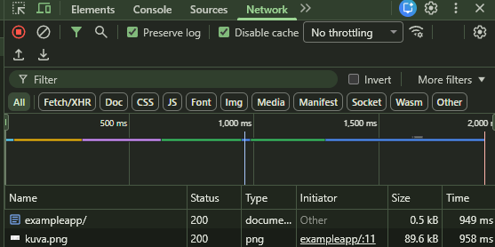
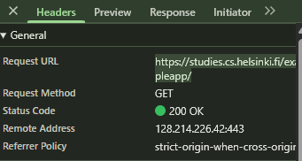
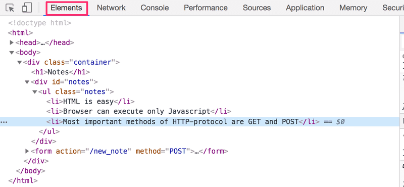

# HTTP GET

Server's and web browser communicate using the HTTP (Hypertext Transfer Protocol) protocol. The Network tab in chrome shows how the browser and the server communicates.

When you reload the page in (Example webpage)[https://studies.cs.helsinki.fi/exampleapp/] the console will show two events that happen:

- The browser has fetched the contents of the page studies.cs.helenski.fi/exampleapp from the server
- And has downloaded the image kuva.png



If we click into the first event e.g. fullstack-exampleapp it shows us more info about what's happening in the *Headers* tab under *General* shows that the browser requested a link https://studies.cs.helsinki.fi/exampleapp/ using the GET method, and that the request was successful because it returned Status code 200



There many other items in the Header that tells us a lot about what is happening between the server and the website.

During the refresh what happens is:

1. The browser sends a GET request to the server to fetch HTML code
2. Server sends back HTML document, which the browser parses (Analysis the code) and renders
3. The img tag inside the HTML document causes the browser to fetch the image
4. The server sends back the png image

The browser can start rendering the HTML immediately, while images and other resources are fetched in parallel.

In many cases the HTML will be the catalyst for what else the website must fetch for example a `script` tag inside the HTML can cause the website to ask the server to fetch the Javascript file containing some sort of code which spices up the image and website.

# DOM (Document Object Model)

We can think of HTML pages as implicit tree structures

```python
html
  head
    link
    script
  body
    div
      h1
      div
        ul
          li
          li
          li
      form
        input
        input
```

The same treelike structure can be seen on the console's Elements tab:


The functioning of the browser is based on the idea of depicting HTML elements as a tree. The DOM is an __Application Programming Interface__ (API) that enables programmatic modification of the element trees corresponding to the web pages.

## Manipulation of DOM

In Javascript the DOM API is the set of build in JavaScript methods that let you interact with certain parts of the tree, such as:

```js
// Find Elements
document.getElementById("title")
document.querySelector("p")

// Change content
element.textContent = "New text"

// Change style
element.style.color = "red"

// Create elements
const li = document.createElement("li")
li.textContent = "Item"
document.body.appendChild(li)
```
A good example of this happening is the follow:

#### HTML
```html
<h1 id="title">Hello</h1>
```
#### Javascript
```js
const title = document.getElementById("title")
title.textContent = "Hi!"
```
The page changes instantly.

The topmost node of the DOM tree of an HTML document is called the document object. We can preform various operations on a webpage using the DOM-API. Access the `document` object by typing `document` into the Console tab

We are able to manipulate the DOM by using the console for example we can add a new note to the page:

```js
list = document.getElementsByTagName('ul')[0]
newElement = document.createElement('li')
newElement.textContent = 'Page manipulation from console is easy'
list.appendChild(newElement)
```

We can see that the changes were made on the browser but the DOM doesn't directly change the source code so if we refresh the new note disappears, this is because it wasn't pushed to the server.

# CSS

The **Head** element of HTML code contains a link tag. Which determines the CSS (Cascading Style Sheet) file that must be fetched from the address main.css (CSS determines what a webpage looks like)


```css
.container {
  padding: 10px;
  border: 1px solid;
}

.notes {
  color: blue;
}
```

The file defines two class selectors. These are used to select certain parts of a webpage and to define the styles of them. Classes are attributes which can be added to HTML elements. e.g. (<div class="container">)

#### Loading a page containing JS - Review 


# HTTP POST 

The HTTP POST request is used when we add a new note based off user input. It requests from the server address new_note. The server responds with HTTP status code 302. This is a URL redirect with which the server asks the browser to preform a new HTTP GET request to the address designed in the header's location - the address notes.

# Single Page app

In the example we were given, the home page works like any other traditional web application. All the logic is handled on the server side and the client side (Web Browser) only handles the HTML rendering as instructed.

In recent years, the Single-page application (SPA) style of creating web apps has emerged. SPA-style websites don't fetch all of their pages separately from the server like our sample application does, but instead comprise only one HTML page fetched from the server, the contents of which are manipulated with JavaScript that executes inside of the browser.

Real examples of SPAs:

- Gmail
- Facebook
- Apps built with React, Vue, Angular, Next.JS (client side)

### Why so popular? 

SPAS are popular because they are faster after initial load, smooth user experience (no flicker/reload) and feels like a mobile app because of seamlessness however it is much more complex then Javascript and has a larger initial load. A good test of if the website is a SPA is if we open an application click something inside the website and the URL changes but the page doesn't reload.

# What is Full-Stack web dev?

It is very ambiguous however in most cases web dev is split between front and back end. Where front end is the browser being closer to the end-user which is the top layer well the server side is more bottom layer. It is common to also have a database layer below the server therefore it is a stack of layers.

Often we can consider the browser as frontend and the JS that runs on the browser as frontend code. The server on the other hand is backend.

The backend in this will be coded with JavaScript, using Node.js runtime environment. Using the same language on multi layers of stack is good but it is not a requirement to use the same language for all layers of the stack.