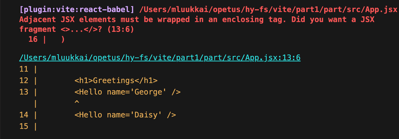
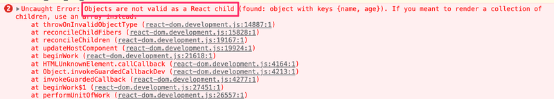

- Usestate
- Useeffect
- red

# Introduction to React

We will now start by creating an application using a tool called __Vite__, Namely the create-vite tool.

```
npm create vite@latest
```

This whole process means we have created an application called part1. If we had answered "Yes" to the question "Install with npm and start now?" the tool would have installed all required dependencies and started the application automatically. But we will work through the steps manually

1. Create the files using npm create vite@latest
2. Change Directory into the folder
3. `npm install` the required library 
4. `npm run dev` to start the process

Vite starts the application by default on port 5172 if its not free it will move to the next port number.

### Component

The file app.jsx now defines a React component with the name App. The command on the final line of main.jsx 

```jsx
ReactDOM.createRoot(document.getElementById('root')).render(<App />)
```

renders its contents into the div-element, defined in the file index.html, having the id value 'root'.

By default, the file index.html doesn't contain any HTML markup that is visible to use in the browser:

```html
<!doctype html>
<html lang="en">
  <head>
    <meta charset="UTF-8" />
    <link rel="icon" type="image/svg+xml" href="/vite.svg" />
    <meta name="viewport" content="width=device-width, initial-scale=1.0" />
    <title>part1</title>
  </head>
  <body>
    <div id="root"></div>
    <script type="module" src="/src/main.jsx"></script>
  </body>
</html>
```

In React all content that needs to be rendered is normally done by using React components...

```jsx
const App = () => (
  <div>
    <p>Hello world</p>
  </div>
)
```
This component will be rendered as a div-tag, which wraps a p-tag containing the text Hello World.

Technically the component is defined as a JS function. The following is a function (which also does not receive any parameters):

```jsx
() => (
  <div>
    <p>Hello world</p>
  </div>
)
```

But the component is then assigned to the constant variable App

```jsx
const App = ...
```

There are a few ways to define an function in JSX the most popular way now is using the arrow function. The function defining the component can be anything such as:

```jsx
const App = () => {
  console.log('Hello from component')
  return (
    <div>
      <p>Hello world</p>
    </div>
  )
}

export default App
```

Which returns Hello from component inside of the console. 

It is also possible to render dynamic content inside of a component.

```jsx
const App = () => {
  const now = new Date()
  const a = 10
  const b = 20
  console.log(now, a+b)

  return (
    <div>
      <p>Hello world, it is {now.toString()}</p>
      <p>
        {a} plus {b} is {a + b}
      </p>
    </div>
  )
}
```

Any JavaScript code within the curly braces is evaluated and the result of this evaluation is embedded into the defined place in HTML produced by the component.

Note that you should not remove the line at the bottom of the component.

NEVER remove:

```jsx 
export default App
```

from the bottom of the component.

# JSX

It seems the React components are retuning HTML markup, however it's not actually the case. The layout of React components is mostly written using JSX (JavaScript XML). Although JSX looks like HTML, we are dealing with a way to write JavaScript, JSX returned by React components is compiled JavaScript.

After compiling (In the context of compiling JSX is essentially the middle man, basically it will take the JSX style and then swap your JSX to normal JavaScript) your code should look like this:

```jsx
const App = () => {
  const now = new Date()
  const a = 10
  const b = 20
  return React.createElement(
    'div',
    null,
    React.createElement(
      'p', null, 'Hello world, it is ', now.toString()
    ),
    React.createElement(
      'p', null, a, ' plus ', b, ' is ', a + b
    )
  )
}
```

The compilation is handled by Babel. Projects created by Vite is are configured to compile automatically. 

In practice JSX is much like an HTML with the distinction that with JSX you can easily embed dynamic content by writing appropriate JS within curly braces. In the end JSX is a templating language.

JSX is "XML-like" In the sense that every tag also needs to be closed e.g. <br> <br />

### Multiple components

Let's modify the file App as follows:

```jsx
const Hello = () => {
  return (
    <div>
      <p>Hello world</p>
    </div>
  )
}

const App = () => {
  return (
    <div>
      <h1>Greetings</h1>

      <Hello />
    </div>
  )
}
```

We have defined a component Hello and used it inside the component App. Naturally a component can be used multiple times.

```jsx
const App = () => {
  return (
    <div>
      <h1>Greetings</h1>
      <Hello />

      <Hello />
      <Hello />
    </div>
  )
}
```

Remember that the export is not inside of these examples but in the future it is still needed to get the code to work.

In the end writing reusable components is easy with React and by combining multiple components we can build in a similar fashion to web dev Lego! Indeed an core philosophy of React is composing applications from many specialized reusable components.

Another very strong convention is the idea of a root component called App at the top of the component tree of the application. However this not always the case where App is not exactly the root, but is wrapped within an an appropriate utility component.


# Props: Passing data to components

It is possible to pass data to components using so called props, an good example of what props are is if we consider an  tag we can use props to determine the size and other aspects of it by using `height`, `src`, `className`, `alt`, `width`...

Let's modify the components Hello as follows:

```jsx
const Hello = (props) => {
  return (
    <div>
      <p>Hello {props.name}</p>
    </div>
  )
}
```

Now the function defining the component has a parameter called props. As an argument, the parameter receives an object, which has fields corresponding to all the "props" the user of the component defines.

The props are defined like this:

```jsx
const App = () => {
  return (
    <div>
      <h1>Greetings</h1>

      <Hello name='George' />
      <Hello name='Daisy' />
    </div>
  )
}
```

There can be any number of props and they can be hard coded strings or the result of JS expressions. If it is JS we must use curly brackets to wrap it.

This is an example of Hello using two props:

```jsx
const Hello = (props) => {

  console.log(props)
  return (
    <div>
      <p>

        Hello {props.name}, you are {props.age} years old
      </p>
    </div>
  )
}

const App = () => {

  const name = 'Peter'
  const age = 10

  return (
    <div>
      <h1>Greetings</h1>

      <Hello name='Maya' age={26 + 10} />
      <Hello name={name} age={age} />
    </div>
  )
```
The props sent by the component App are the values of the variables, the result of the evaluation of sum expressions and a hard coded string maya.

Hello also logs the value of the props into the console.

# Some notes and ideas to keep in mind

React has been configured to generate a very clear error message. Despite this it is advised to take very small steps and make sure that each change works as desired.

__THE CONSOLE SHOULD ALWAYS BE OPEN__. If the browser reports an error do not code extra but instead work out and backtrack what the possible error is and understand why it happened. A really really good habit to build up is adding console.log() within the code.

Also another thing to mention is that React requires __The first letter of React components must be capitalized__ this:

```jsx
const footer = () => {
  return (
    <div>
      greeting app created by <a href='https://github.com/mluukkai'>mluukkai</a>
    </div>
  )
}
```

Won't work if you tried to run it:

```jsx
const App = () => {
  return (
    <div>
      <h1>Greetings</h1>
      <Hello name='Maya' age={26 + 10} />

      <footer />
    </div>
  )
}
```

The page isn't gonna display the content which is defined in the footer component, but instead React would only create an empty footer element, i.e. the built-in HTML element instead of custom React elements of the same name. If you change it to upper case then React creates a div-element defined in the Footer component, which is rendered on the page.

Note that the content of a React component (usually) needs to contain one root element. If we, for example, try to define the component App without the outermost div-element:

```jsx
const App = () => {
  return (
    <h1>Greetings</h1>
    <Hello name='Maya' age={26 + 10} />
    <Footer />
  )
}
```

This error would occur:




Using an root element e.g. <div> </div> is not the only method we can also wrap the components in an array which would also work:

```jsx
const App = () => {
  return [
    <h1>Greetings</h1>,
    <Hello name='Maya' age={26 + 10} />,
    <Footer />
  ]
}
```

But this is ugly.

Because the root element is stipulated (needed/demanded), we have an "extra" element in the DOM tree. This can be avoided by using fragments, i.e. by wrapping the elements to be returned by the component with an empty element:

```jsx
const App = () => {
  const name = 'Peter'
  const age = 10

  return (
    <>
      <h1>Greetings</h1>
      <Hello name='Maya' age={26 + 10} />
      <Hello name={name} age={age} />
      <Footer />
    </>
  )
}
```

And in the end it compiles and the DOM generated by react no longer has the extra div element.

# Do not render objects

Consider an application that prints the name and age of friends on screen:

```jsx
const App = () => {
  const friends = [
    { name: 'Peter', age: 4 },
    { name: 'Maya', age: 10 },
  ]

  return (
    <div>
      <p>{friends[0]}</p>
      <p>{friends[1]}</p>
    </div>
  )
}

export default App
```
Yet nothing is printing? However if we look at the console log we see this error:


The core issue is that objects are not valid as an React child, i.e. the application tries to render the object and it fails again.

The code attempts to render the info of one friend:

```jsx
<p>{friends[0]}</p>
```

But a problem occurs because it is an object which needs to be rendered

```jsx
{ name: 'Peter', age: 4 }
```

In React the individual items being rendered in braces must be primitive values, such as numbers or strings

```jsx
const App = () => {
  const friends = [
    { name: 'Peter', age: 4 },
    { name: 'Maya', age: 10 },
  ]

  return (
    <div>
      <p>{friends[0].name} {friends[0].age}</p>
      <p>{friends[1].name} {friends[1].age}</p>
    </div>
  )
}

export default App
```
After fixing clear the console of error messages and reload to ensure no more errors occur.
